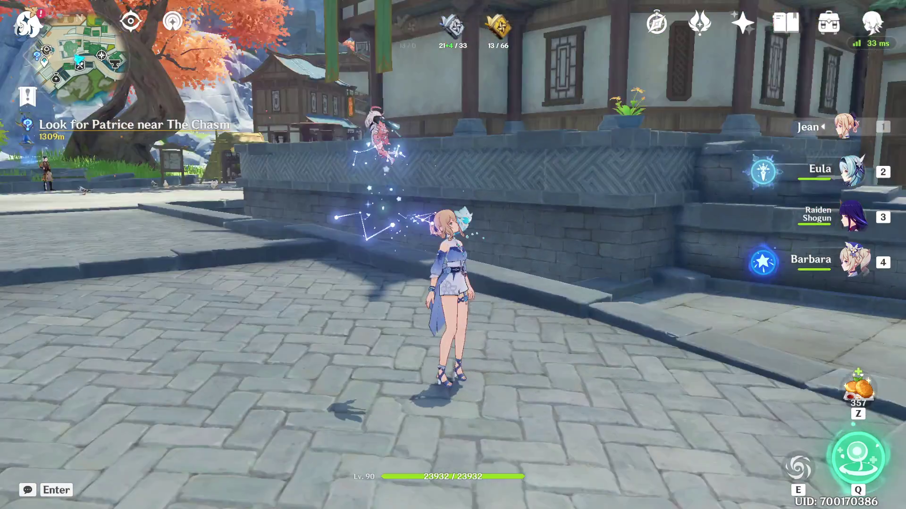

# GI Overlay

# Disclaimer

Although it doesn't tamper with the game's files nor the game's memory, this still count as 3rd party software.

Even if the name state that this is an overlay:

- ❌ It doesn't inject itself into the game
- ❌ It doesn't tamper the game's file
- ❌ It doesn't tamper the game's memory
- ❌ *It doesn't read your screen* *
- ✅ It uses keyboard shortcuts only

So, by using this, you should be pretty safe, but I can't be responsible for any ban that would occur by using this.
Again, ***this still count as 3rd party software*** (but *bad* Hoyoverse if you ban for this).

> I might add ***optional*** support for reading the screen content later. It would allow to automatically detect needed
> materials and also automatically detect your loot when in a domain. But as I don't have any freaking idea on how to do
> it, I'll put that on hold for the moment _(if you want to contribute on that, you are more than welcome!)_.

# Purpose

The sole purpose of this program is to help you keep track of your farming progress without ever using alt+tab. F~~or
now,
it only supports talent books, but I plan adding weapon materials and character materials.~~ It supports every book and
multiple characters at the same time for your comfort now!

When you have more talent materials than needed for a rarity, the excess will be used to simulate crafting the rarity
above. This allows you to better plan your farming session rather than going blindly and craft from time to time to
follow your progress.

You can also use the `Upgrade` button on a character talent to automatically consume available materials and add one
level. If the upgrade is only possible after crafting, the application won't let you upgrade: You'll need to craft and
update your inventory accordingly. This is done like this because some characters give you bonus while crafting, which
can't be handled by the application automatically for obvious reasons.

# How to use

> This is for the application before the UI rewrite. The new UI isn't finished yet (missing the overlay)

Using the program is pretty straightforward. You only have three "screens":

- **Current GenshinTalent Level:** This is the screen where you will configure the talent level of the character of your
  choice. Please note that constellations can modify the effective level of your talents: If the number is blue, please
  remove 3 levels (and only 1 for normal attack if you have Tartaglia passive applied).
- **Target GenshinTalent Level:** This is the screen where you will tell to which level you want to upgrade your
  character's
  talents. This screen is very similar to the previous one, only the small title on the bottom changes, watch out !
- **Book Screen:** *Yes, this one doesn't have a real title*. This is the screen where you'll see how many books you
  need of each type to upgrade your character's talents. You can set the amount book you already have here, and
  increment them as you loot in a domain. Once the target amount has been reached, the extra book you'll add will be
  used to count how many book of higher level you can craft. The number of crafted book will be displayed in green.

#### Shortcuts:

- `CTRL`+`ALT`+`Arrow Left`: Select the previous frame
- `CTRL`+`ALT`+`Arrow Right`: Select the next frame
- `CTRL`+`ALT`+`Arrow Up`: Increment the number in the current selected frame
- `CTRL`+`ALT`+`Arrow Down`: Decrement the number in the current selected frame
- `CTRL`+`ALT`+`Enter`: Move to next screen*
- `CTRL`+`ALT`+`Backspace`: Move to previous screen
- `CTRL`+`ALT`+`End`: Close the program
- `CTRL`+`ALT`+`Home`: Reset the program and goes back to the first screen

> When on the last screen (Book Screen), using `CTRL`+`ALT`+`Enter` will toggle edit mode. When the edit mode is turned
> off, the black background on the selected frame will disappear. No other shortcuts will work until you enable the edit
> mode back (except reset and close shortcuts, of course). This is to avoid any useless distraction.

## Help, I have a bug

I'm working on this project on my free time. Please open an issue: I'll try to look into it A.S.A.P (when I feel
motivated enough...)

## Oh, I just had an idea !

I'm always open to new ideas to enhance my project. Please open an issue to talk about your idea.

## Hm, I have a question for you

If the question is related to this project, please open an issue. Otherwise, please contact me on
Discord (`Akio Nakao#0001`)

## Can I contribute ?

I'm open to contributions, but before wasting your time on a new feature, please open an issue first. It will allow
everyone to know what is being worked on and follow the progress on it.
